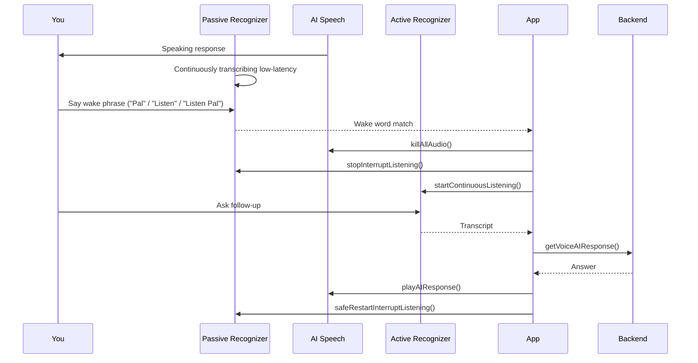

# HighPal Wake Word ("Pal" / "Listen" / "Listen Pal") Troubleshooting Guide

This guide helps you diagnose and fix issues when saying a wake phrase ("Pal", "Listen", or "Listen Pal") does not interrupt the AI or start active listening.

## ✅ Current Intended Behavior

During a voice conversation:

1. If AI is speaking and you say: `Pal what is photosynthesis` (or start with `Listen ...`) → AI should stop immediately and answer.
2. If AI is speaking and you just say: `Pal`, `Listen`, or `Listen Pal` → AI stops, then actively listens for your next question (new behavior).
3. If AI is NOT speaking and you say only the wake word, nothing special happens (passive loop is already running and awaiting your full question).

## 🔧 Quick Checklist

| Check | What to Do |
|-------|------------|
| Microphone permission | Click the lock icon in the browser bar → Allow microphone |
| Browser support | Use Chrome or Edge (SpeechRecognition not in Firefox/Safari fully) |
| HTTPS/Secure context | `localhost` is OK; avoid running from `file://` |
| Console errors | Open DevTools (F12) → Console tab → look for red errors related to speech |
| Multiple tabs | Close duplicate HighPal tabs (can compete for mic) |
| Background noise | Test in a quiet room first |

## 🆕 What Was Changed

| Change | Purpose |
|--------|---------|
| Wake word alone now triggers an active capture | Previously only "Pal" alone did nothing; now "Pal", "Listen", or the phrase "Listen Pal" open a short listening window |
| Updated user tip text | Reflects new behavior |
| Global debug helper `window.highpalWakeDebug` | Quick inspection + manual restart |
| Added `public/wake_word_diagnostic.html` | Stand‑alone passive recognition tester |

## 🛠️ Debug Commands (Run in DevTools Console)

```js
window.highpalWakeDebug.state();       // Show internal wake state
window.highpalWakeDebug.enable();      // Turn ON verbose logging
window.highpalWakeDebug.disable();     // Turn OFF verbose logging
window.highpalWakeDebug.restartPassive(); // Force passive recognizer restart
window.highpalWakeDebug.killAllAudio();   // Hard stop any lingering audio
```

Expected `state()` output example:
```json
{
  "aiSpeaking": false,
  "passiveActive": true,
  "voiceState": "listening",
  "conversationActive": true,
  "isProcessingInterrupt": false
}
```

## 🔬 Using the Diagnostic Page

1. Start the frontend: `npm run dev`
2. Open: `http://localhost:5173/wake_word_diagnostic.html`
3. Click “Start Passive Listening”
4. Say variations: `pal`, `paul`, `pell`, plus `listen`, and the phrase `listen pal`.
5. Look for log lines: `WAKE WORD DETECTED: pal`

If nothing logs:
* Confirm `webkitSpeechRecognition` exists: `window.webkitSpeechRecognition`
* Switch to Chrome / Edge (Chromium)
* Check Windows privacy settings: Settings → Privacy & Security → Microphone → Allow apps + browsers

## 🧠 How Wake Word Flow Works Now



## 🎯 Common Failure Modes & Fixes

| Symptom | Likely Cause | Fix |
|---------|--------------|-----|
| Saying "Pal" does nothing | Passive recognizer not running | In console: `window.highpalWakeDebug.restartPassive()` |
| AI stops but no follow-up captured | Background noise triggered wake; you paused too long | After saying `Pal`, speak within ~3–4s |
| Immediate interrupts all the time | Ambient noise > threshold | Move mic away / reduce fan noise |
| Never interrupts | Mic permission revoked | Re‑allow mic, refresh page |
| Works once then never again | Stuck recognizer after `.abort()` | `restartPassive()` or END session and restart |
| "Listen" not detected but "Pal" is | Grammar bias favors original set | Try saying "Listen Pal" (merged phrase) or increase clarity; future backend hotword model will improve this |

## 🧪 Manual Test Script (Scenario Matrix)

| Step | Action | Expected |
|------|--------|----------|
| 1 | Start voice conversation | Welcome message plays |
| 2 | While AI speaks, say `Pal` | Audio stops immediately, overlay shows Listening |
| 3 | Ask follow-up within 3s | AI processes & responds |
| 4 | While next response plays, say `Pal what is inertia` | Immediate stop + direct answer |
| 5 | Say nothing for 5 min | Auto-pause triggers |
| 6 | Say `resume` (or click Resume) | Loop continues |

## 🧩 Future Enhancements (Optional)

| Idea | Benefit |
|------|---------|
| Porcupine / Picovoice offline hotword | Lower latency & no browser API dependence |
| Move wake logic to Web Worker | Reduce UI thread contention |
| Dynamic energy thresholding | Fewer false positives in noisy rooms |
| Keyword spotting via Azure SDK streaming | More robust multi-keyword support |

## ❓ Still Broken?

Capture this info and open an issue:
```
Browser: (Chrome 128? Edge?)
OS: Windows 10/11
Console output of: window.highpalWakeDebug.state()
Any errors in DevTools Console
Did diagnostic page detect wake word? (Yes/No)
```

---
Maintained automatically with recent wake word improvements (see commit introducing active follow‑up capture).
